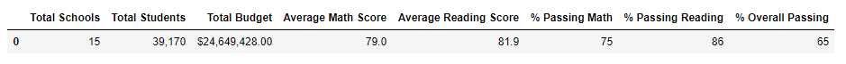
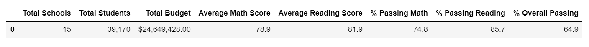
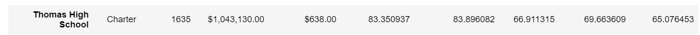
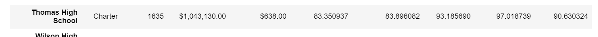
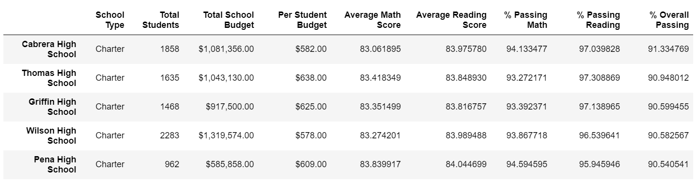
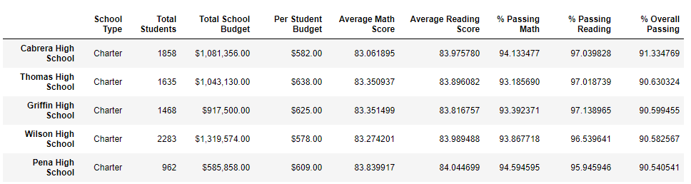

# School District Analysis

## Overview of the school district analysis: 
- Explain the purpose of this analysis. 
- The purpose of this analysis is well defined (3 pt).

Here is the list of deliverables for the analysis of the school district: 

A high-level snapshot of the district's key metrics, presented in a table format
An overview of the key metrics for each school, presented in a table format
Tables presenting each of the following metrics:
Top 5 and bottom 5 performing schools, based on the overall passing rate
The average math score received by students in each grade level at each school
The average reading score received by students in each grade level at each school
School performance based on the budget per student
School performance based on the school size 
School performance based on the type of school

The school board has notified Maria and her supervisor that the students_complete.csv file shows evidence of academic dishonesty; specifically, reading and math grades for Thomas High School ninth graders appear to have been altered. Although the school board does not know the full extent of the academic dishonesty, they want to uphold state-testing standards and have turned to Maria for help. She has asked you to replace the math and reading scores for Thomas High School with NaNs while keeping the rest of the data intact. Once you’ve replaced the math and reading scores, Maria would like you to repeat the school district analysis that you did in this module and write up a report to describe how these changes affected the overall analysis.

## Results: 
- Using bulleted lists and images of DataFrames as support, address the following questions. There is a bulleted list that addresses how each of the seven school district metrics was affected by the changes in the data (10 pt).

-	District Summary:
  - Although Maria asked that we replace the ninth grade scores with "NaN" for Thomas High School, the District Summary numbers do not appear to be much different.	
  - Original District Summary:
  
    
    
  - Updated District Summary:  
    
    
    
- School Summary:
  - Original School Summary:
  
     
    
  - Updated District Summary:
   - Thomas High School Including 9th Grade "NaN":

    
   
   - Thomas High School Including Only 10th to 12th Grades:
   
   
    
-	How does replacing the ninth graders’ math and reading scores affect Thomas High School’s performance relative to the other schools?
  - Top Schools Original
    
  - Top Schools Updated
    
  
- How does replacing the ninth-grade scores affect the following Math and reading scores by grade:
  - Scores by school spending
    - THS Spending Original
    - THS Spending Updated
    - Overall School Size Formatted Same
    - Overal Spending Summary Original
    - Overall Spending Summary Updated
  - Scores by school size
    - Overall School Size Formatted Same
    - Overall School Size summary Not formated original
    - Overall School Size summary Not Formatted Updated 
  - Scores by school type

## Summary: 
- Summarize four major changes in the updated school district analysis after reading and math scores for the ninth grade at Thomas High School have been replaced with NaNs. There is a statement summarizing four major changes to the school district analysis after reading and math scores have been replaced (5 pt).
- 1)
- 2)
- 3)
- 4)
-
