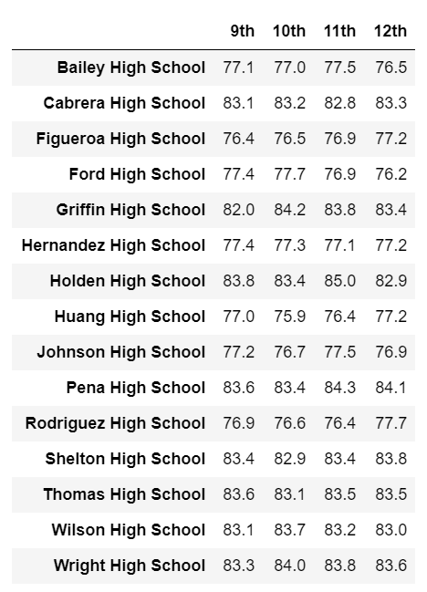
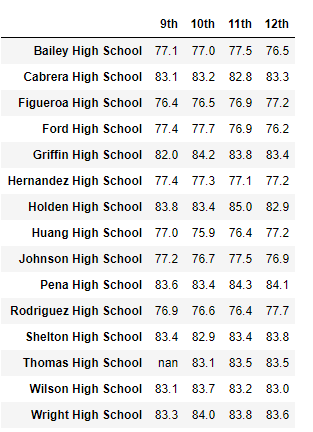
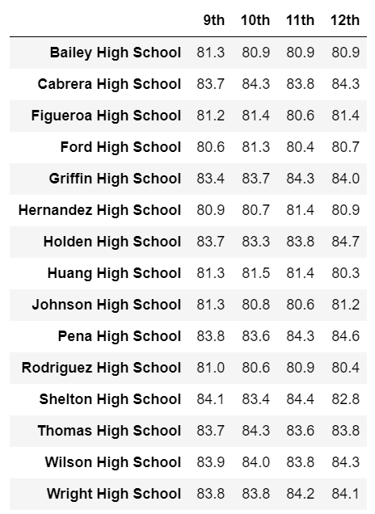
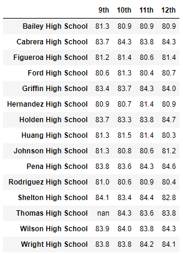

# **School District Analysis**

##  **School District Analysis - Overview:** 
The purpose of this project was to assist Maria and her supervisor with school district analysis.  The original list of deliverables for the analysis of the school district are as follows: 
- A high-level snapshot of the district's key metrics, presented in a table format
- An overview of the key metrics for each school, presented in a table format
- Tables presenting each of the following metrics:
  - Top 5 and bottom 5 performing schools, based on the overall passing rate
  - The average math score received by students in each grade level at each school
  - The average reading score received by students in each grade level at each school
  - School performance based on the budget per student
  - School performance based on the school size 
  - School performance based on the type of school

According to Maria, the school board notified her and her supervisor of the following:

> "...The students_complete.csv file shows evidence of academic dishonesty; specifically, reading and math grades for Thomas High School ninth graders appear to have been altered..."

Specifically for this portion of the project, Maria would like the deliverables to include a repeat of the school district analysis outlined above, replacing the math and reading scores for Thomas High School ("THS") ninth graders with NaNs and a report to describe how these changes affected the overall analysis.

The loc method was utilized to isolate the THS ninth grade reading and math scores, and they were set to equal to np.Nan as follows:

`student_data_df.loc[(student_data_df["school_name"]=="Thomas High School") & (student_data_df["grade"]=="9th") , "reading_score"] = np.NaN
student_data_df`

## **School District Analysis - Analysis and Results:** 

### **District Summary:**
Although Maria asked that the THS ninth grade scores be replaced with NaNs, this change doesn't appear to have made much of an impact on the final analysis. See the following screenshots of the original versus the updated District Summary results.  

- Original District Summary:
  
  
    
- Updated District Summary:  
    
  
    
### **School Summary:**
When comparing the THS original School Summary with the updated School Summary that includes only tenth to twelfth grade scores, the numbers changed slightly, but this change doesn't appear to have made a significant impact on the final analysis.
  
- Original School Summary:
  
   
    
- Updated School Summary - Includes THS 10th to 12th Grades only:
   
   
  
When running the School Summary with the 9th graders included, you'll see that the reading, math, and overall percentages drop drastically.

- Updated School Summary - Includes THS 9th Grade:

   
    
### **Affect on THS Performance Relative to Other Schools:**
The following screen shots show the top five performing schools in the district.  When comparing the original output versus the updated output, THS remains in the second position with regard to their performance relative to other schools.

- Top Schools Original:

  

- Top Schools Updated
    
  
  
### **Affect on Math and Reading Scores by Grade:**
The following screen shots illustrate the original Math and Reading scores and the updated Math and Reading scores per grade level.  As shown below, the THS ninth graders have been replaced with Nan, and the remaining THS grade levels do not change.

- THS Original Math:

  
  
- THS Updated Math:

  
  
- THS Original Reading:

  
  
- THS Updated Reading:
   
  
  
### **Affect on Scores by School Spending:**
THS falls into the $630 to $644 spending range per student.  The overall passing percentage dropped slightly when the 9th graders were removed, but it doesn't appear significant enough to change the Overall School Spending Summary once it's been formatted; see screen shots below.    

- THS Spending Original:

  
      
- THS Spending Updated:
      
  
  
- Overall School Spending:
  
  
  
     
### **Affect on Scores by School Size:**
THS falls into the medium sized category range (1,000 to 2,000 students) with 1,635 total students.  Before formatting, you can see the percentages slightly dropped, but per the Overall School Size Formatted Summary below, you can see that dropping the ninth grade scores weren't significant enough to make an impact on the final numbers so the summary remained unchanged.

- Overall School Size Formatted Summary:
      
  
    
- Overall School Size Summary Original:
      
  
    
- Overall School Size Summary Updated: 
      
  
 
### **Affect on Scores by School Type:**
THS appears to be a Charter school.  As you can see, prior to formatting, it appears that the passing percentages dropped slightly, but post formatting, the Overall School Type Formatted Summary appears to be unchanged when utilizing THS tenth to twelfth grade scores.
    
- Overall School Type Formatted Summary: 
      
  
    
- Overall School Type Summary Original:
      
  
    
- Overall School Type Summary Updated:
      
   

## School District Analysis - Summary: 
There were only 461 THS students in ninth grade which makes up about 1% of the total student count so overall there wasn't a significant change to the outputs when the ninth graders were removed.

- When the THS ninth grade NaNs were included, the percentage passed dropped drastically.  This would make sense because you're counting the same number of students, but not the scores. See the screenshots:   

  - Average Math: 66.9%, Average Reading: 69.7%, Overall Passing: 65.1%
  
  
  
  - Average Math: 93.3%, Average Reading: 97.3%, Overall Passing: 90.9%
  
  
    
-  Another significant change made to the code was the adjustment of isolating the tenth to twelfth grade THS students using the loc method.  This allowed us to calculate all of the updated outputs that were, overall, very similar to the original outputs.

  - `tenth_to_twelfth_count = student_data_df.loc[(student_data_df["grade"] != "9th") & (student_data_df["school_name"] == "Thomas High School"), ["Student ID"]].count()`

- Another significant output change is when you look at the math scores by grade, you can see that the math grades were replaced by the Nans.

  

- This significant change also applies to the reading scores by grade; the output is significantly different because the reading scores are replaced by Nans.

  
