# **School District Analysis**

##  **School District Analysis - Overview:** 
The purpose of this project was to assist Maria and her supervisor with school district analysis.  The original list of deliverables for the analysis of the school district are as follows: 
- A high-level snapshot of the district's key metrics, presented in a table format
- An overview of the key metrics for each school, presented in a table format
- Tables presenting each of the following metrics:
  - Top 5 and bottom 5 performing schools, based on the overall passing rate
  - The average math score received by students in each grade level at each school
  - The average reading score received by students in each grade level at each school
  - School performance based on the budget per student
  - School performance based on the school size 
  - School performance based on the type of school

According to Maria, the school board notified her and her supervisor of the following:

> "...The students_complete.csv file shows evidence of academic dishonesty; specifically, reading and math grades for Thomas High School ninth graders appear to have been altered..."

Specifially for this portion of the project, Maria would like the deliverables to include a repeat of the school district analysis outlined above, replacing the math and reading scores for Thomas High School ("THS") ninth graders with NaNs and a report to describe how these changes affected the overall analysis.

The loc method was utilized to isolate the THS ninth grade reading and math scores and set them equal to np.Nan as follows:

`student_data_df.loc[(student_data_df["school_name"]=="Thomas High School") & (student_data_df["grade"]=="9th") , "reading_score"] = np.NaN
student_data_df`

## **School District Analysis - Analysis and Results:** 

### **District Summary:**
Although Maria asked that the THS ninth grade scores be replaced with NaNs, this change doesn't appear to have made much of an impact on the final analysis. See the following screenshots of the original versus the updated District Summary results.  

- Original District Summary:
  
  
    
- Updated District Summary:  
    
  
    
### **School Summary:**
When comparing the THS original School Summary with the updated School Summary that includes only tenth to twelfth grade scores, the numbers changed slightly, but this change doesn't appear to have made a significant impact on the final analysis.
  
- Original School Summary:
  
   
    
- Updated School Summary - Includes THS 10th to 12th Grades only:
   
   
    
### **Affect on THS Performance Relative to Other Schools:**
The following screen shots show the top five performing schools in the district.  When comparing the original output versus the updated output, THS remains in the second position with regard to their performance relative to other schools.

- Top Schools Original:

  

- Top Schools Updated
    
  
  
- How does replacing the ninth-grade scores affect the following Math and reading scores by grade:
  - Scores by school spending
    - THS Spending Original
      
    - THS Spending Updated
      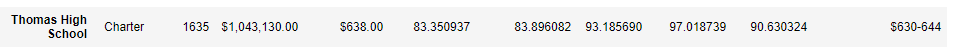
    - Overall School Spending Formatted Same
      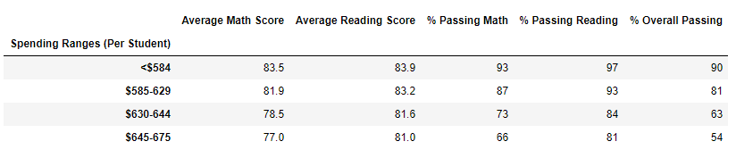
    - Overal Spending Summary Original
      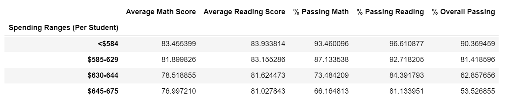
    - Overall Spending Summary Updated
      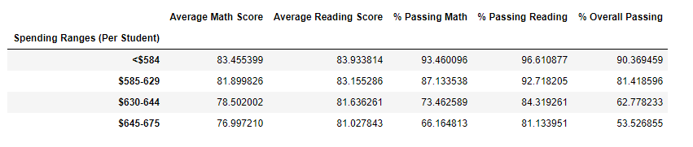
  - Scores by school size
    - Overall School Size Formatted Same
      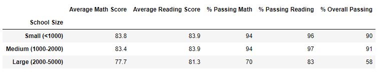
    - Overall School Size summary Not formated original
      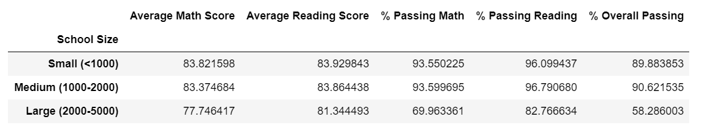
    - Overall School Size summary Not Formatted Updated 
      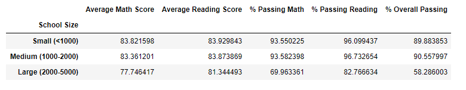
  - Scores by school type
    - Overall School Type Formatted Original
      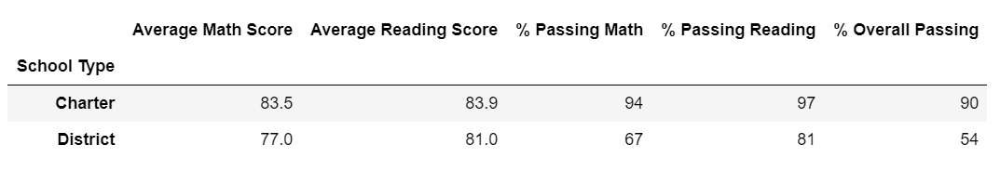
    - Overall School Type summary Formatted Updated
      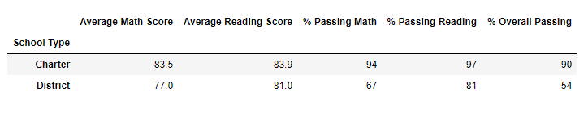
    - Overall School Type summary Not Formatted Original
      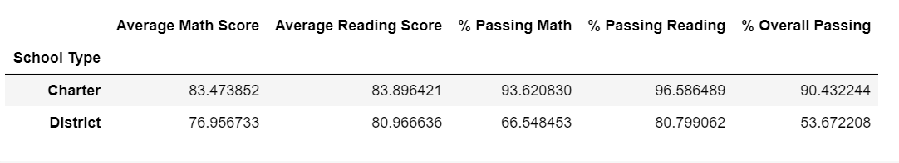
    - Overall School Type summary Not Formatted Updated 
      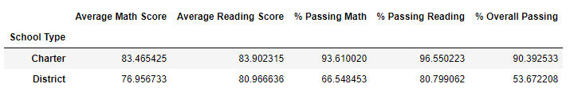 

## School District Analysis - Summary: 
- Summarize four major changes in the updated school district analysis after reading and math scores for the ninth grade at Thomas High School have been replaced with NaNs. There is a statement summarizing four major changes to the school district analysis after reading and math scores have been replaced (5 pt).
- 1)
- 2)
- 3)
- 4)
-
